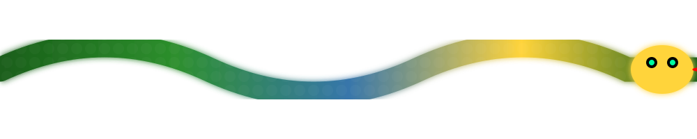

  
  <!-- CINEMATIC DARK HEADER -->
  
  
  <h1>🐍 The Python Journey</h1>
  
  <!-- TYPING ANIMATION -->
  

    
  

  <!-- ANIMATED PYTHON SNAKE -->
  
   
  <i>🐍 My Python Learning Journey - Always Moving Forward</i>

  <!-- STATUS BADGES -->
  

    
    
    
    
  

---

### ⚡️ WHO IS BARSAM?

<table align="center" border="0" cellpadding="0" cellspacing="0" style="background: #0d1117; color: #c9d1d9;">
<tr>
<td valign="top" width="50%">

#### 🇮🇷 Iranian Tech Prodigy

> *"I don't just write code; I define the future of privacy-preserving AI."*

من **برسام باغبان‌زاده** هستم. یک پژوهشگر **۱۴ ساله** اهل **رشت، ایران**.

- 🎓 دارای **گواهینامه هوش مصنوعی از دانشگاه صنعتی شریف**
- 🔬 پژوهشگر فعال در حوزه **Federated Learning & HealthTech**
- 💻 در حال تسلط کامل بر **Python** و معماری‌های پیشرفته AI
- 📄 نویسنده مقاله پژوهشی *"Federated Learning in Healthcare"*

من اینجام تا **قوانین بازی هوش مصنوعی در پزشکی** را تغییر دهم.

</td>
<td valign="top" width="50%">

#### 🏆 ELITE CERTIFICATIONS

| 🎖️ Title | 🏢 Institution | 📅 Year |
| :--- | :--- | :--- |
| **AI Certificate** | Sharif University of Tech | 2024 |
| **ICDL International** | Technical & Vocational Org | 2023 |
| **FL Research Paper** | Published on GitHub | 2025 |
| **Open Source Leader** | Global Community | Active |

  
  

</td>
</tr>
</table>

---

### 🛠️ TECH ARSENAL

  

  

---

### 📊 LIVE STATS

  
  

  

---

### 📝 LATEST RESEARCH

#### [Federated Learning in Healthcare: Opportunities and Challenges](https://barsambaghbanzadeh-ir.github.io/Barsam/)

> **Abstract:** This paper explores the paradigm of Federated Learning (FL) in healthcare, addressing the critical need for privacy-preserving AI models. It discusses the principles of FL, its clinical applications in medical imaging, and the technical challenges such as Non-IID data and security threats.

- **Key Topics:** Federated Averaging (FedAvg), Differential Privacy, Medical Imaging, HIPAA/GDPR Compliance
- **Status:** Published on GitHub Pages

---

### 🌐 GLOBAL CONNECT

  
  
  
  

---

  ⚡ Crafted with ❤️ & ☕ in Rasht, Iran | Built for the Future
   
  

